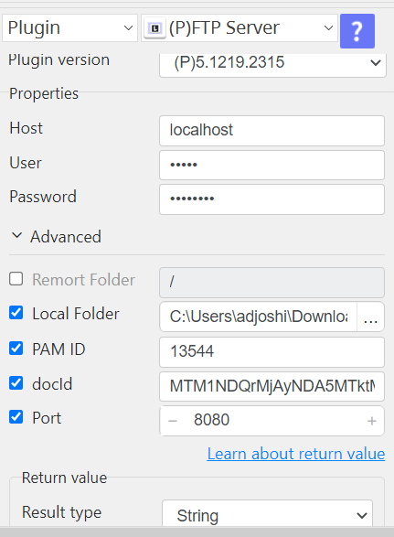

# FTP Server

***This plugin allows to access the FTP server and download files from FTP server and also we can delete the downloaded file from FTP Server.***

## FTP Server
| Item         |          Value          |
|--------------|:-----------------------:|
| Icon         |  |
| Display Name |     **Lazarus FTP**     |

## Arun Kumar (ak080495@gmail.com)

Arun Kumar
* [Email](mailto:ak080495@gmail.com) 
 
## Version Control 
* [5.1206.755](setup.yaml)
* Release Date: `November 04, 2024`

## Input (Required)

| Parameters         | Selection               | Default Value |
|:-------------------|-------------------------|---------------|
| Server Properties  | Host                    |               |
|                    | User                    |               |
|                    | Password                |               |
|                    | Remote Folder           |               |
|                    | (Download) Local Folder |               |
|                    | PAM ID                  |               |
|                    | DOC ID                  |               |
|                    |                         |               |
| Advance Properties | Port                    |               |
|                    | Remove Files            |               |                      
[//]: # (### Notes:-)

[//]: # (<ul>)

[//]: # (    <li>FTP Mode active/passive choose according host.</li>)

[//]: # (</ul>)

## Return Value
[//]: # (### Normal Case)
Description of output result
<ul>
<li>
   String (default)
   Save the specified file in Local Folder and return a string with the file
   path as Return Value
 </li>
</ul>

## Return Code
| Code | Meaning                      |
|------|------------------------------|
| 0    | Success                      |
| 99   | Exceptional case             |

## Output Format
You may choose one of 3 output formats below,

<ul>
  <li>String (default)
   Save the specified file in Local Folder and return a string with the file
   path as Return Value
 </li>
  <li>CSV</li>
  <li>File</li>
</ul>  

## Parameter setting examples (diagrams)
[//]: # (## Operations)
[//]: # (### Download Files:)

